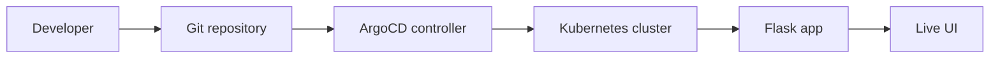

# GitOps with ArgoCD

This repository is a small end-to-end demo of GitOps with ArgoCD. It uses a Flask app with a UI that surfaces deployment metadata from Kubernetes so you can visibly see what changed after each Git commit and sync.

## Table of Contents

- [GitOps with ArgoCD](#gitops-with-argocd)
  - [Table of Contents](#table-of-contents)
  - [What is GitOps?](#what-is-gitops)
  - [Why GitOps?](#why-gitops)
  - [Traditional deployments](#traditional-deployments)
  - [GitOps deployments](#gitops-deployments)
  - [ArgoCD architecture](#argocd-architecture)
  - [Installing ArgoCD](#installing-argocd)
  - [Running the demo](#running-the-demo)
  - [Demonstrations](#demonstrations)
  - [Advanced demonstrations](#advanced-demonstrations)
  - [Troubleshooting](#troubleshooting)

## What is GitOps?

GitOps is an operating model where Git is the source of truth for application and infrastructure state. Instead of pushing changes directly to clusters, you declare the desired state in Git and let an automated controller converge the live environment to match it.

The practical effect is simple: a Git commit becomes a change record, a deployment record, and a rollback point.

## Why GitOps?

GitOps makes deployments auditable, repeatable, and easy to reason about. Every change has a reviewable diff, the target state is versioned, and the reconciliation loop continuously checks for drift.

For demos, GitOps is especially useful because you can show the before-and-after state of a release by changing a single manifest value and then letting ArgoCD sync it.

## Traditional deployments

In a traditional push-based model, a developer or pipeline applies changes directly to the cluster. That works, but it also spreads deployment logic across scripts, manual steps, and shared operational knowledge.

The downside is drift: the live environment can diverge from what is documented in source control, and it becomes harder to answer the question, "What is actually running right now?"

## GitOps deployments

GitOps flips the direction of control. You commit the desired state to Git, ArgoCD watches the repository, and the controller applies the difference between Git and the live cluster.

This project demonstrates that flow with a simple Flask app:

- the code renders values from environment variables
- the Kubernetes manifests define those values
- ArgoCD keeps the cluster aligned with Git
- a visible UI change confirms the sync worked

## ArgoCD architecture



ArgoCD compares the repo with the cluster, reports sync and health status, and applies the desired state when it detects a change or when you request a manual sync.

## Installing ArgoCD

If ArgoCD is not already installed, install it in your cluster first. The standard installation uses the upstream manifests and exposes the ArgoCD API server for UI access.

After installation, create the `gitops-demo` project and application from the YAML files in the `argocd/` folder.

## Running the demo

1. Build and publish the container image for the Flask app.
2. Update the `image` value in [kubernetes/deployment.yaml](kubernetes/deployment.yaml).
3. Apply the namespace, project, and application manifests in [argocd/](argocd/).
4. Let ArgoCD sync the `kubernetes/` folder into the target namespace.
5. Open the ingress host and confirm the UI shows the deployment metadata.

For local development, you can also run the app directly:

```bash
pip install -r app/requirements.txt
python app/app.py
```

The app listens on port `8080` and also exposes `/api/context` and `/healthz`.

## Demonstrations

The cleanest demo sequence is to change a single manifest field and watch the UI update after ArgoCD syncs.

Try these changes:

- change `APP_VERSION` in [kubernetes/deployment.yaml](kubernetes/deployment.yaml)
- rewrite `DEPLOYMENT_MESSAGE` to describe the release
- change `ACCENT_COLOR` to give the release a different visual identity
- update `COMMIT_SHA` to show the exact Git revision being deployed

Each change will show up in the dashboard as a visible release difference rather than a hidden backend-only update.

## Advanced demonstrations

Once the basic loop is working, you can expand the demo:

- turn off automation in [argocd/application.yaml](argocd/application.yaml) and show manual syncs
- introduce a deliberate drift in the cluster and let ArgoCD self-heal it
- set a new ingress host in [kubernetes/ingress.yaml](kubernetes/ingress.yaml) and watch Git update routing
- change the namespace in [kubernetes/namespace.yaml](kubernetes/namespace.yaml) to show how Git can drive environment changes too

## Troubleshooting

If the app does not load, check the following:

- the image exists in the registry and the cluster can pull it
- the ArgoCD application is synced and healthy
- the ingress controller is installed and the host name resolves
- the namespace in the manifests matches the destination namespace in [argocd/application.yaml](argocd/application.yaml)
- the service target port is `8080` and the container is listening on the same port

If the page loads but the values do not change, verify that the manifests were committed to Git and that ArgoCD has reconciled the new revision.